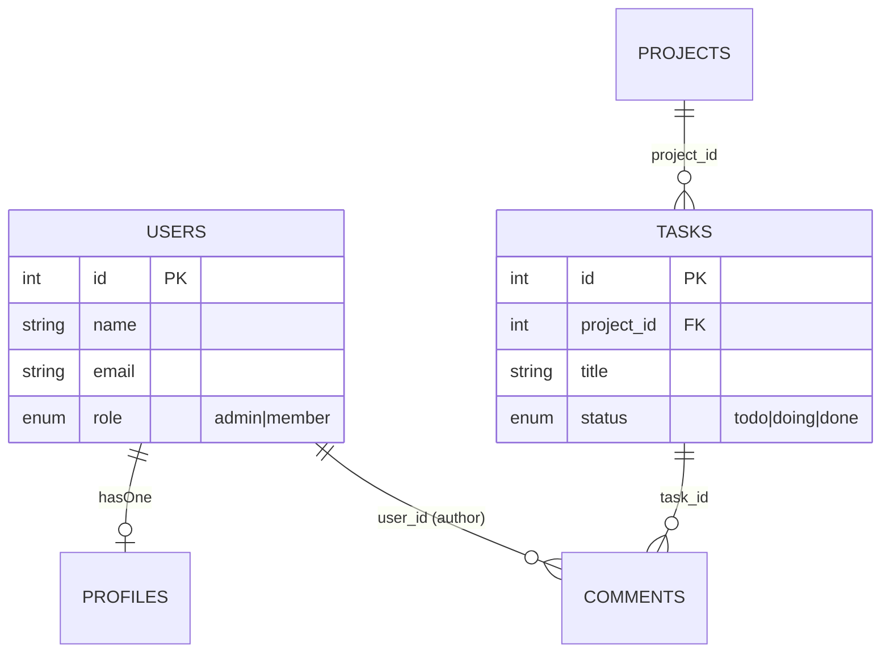
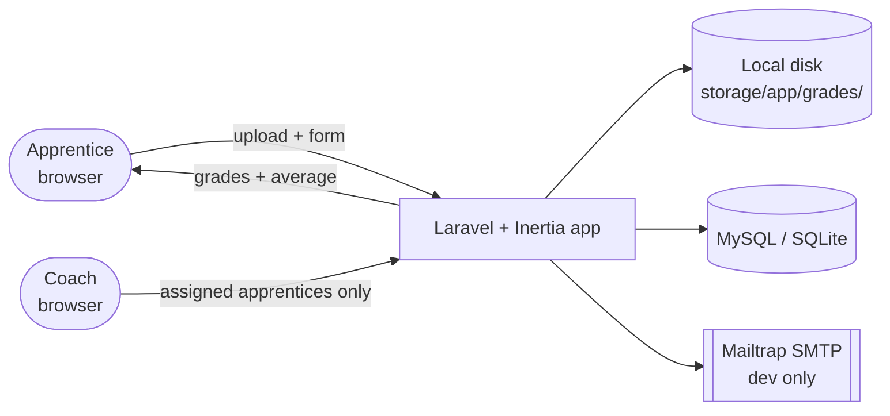
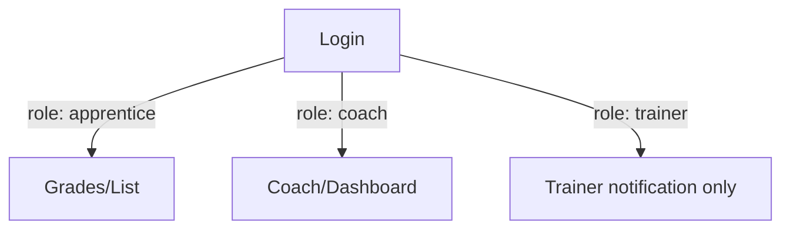

# Mermaid conventions for planning docs

Use these diagram types consistently across `spec.md` and `ARCHITECTURE.md`. All diagrams go in
fenced ```mermaid code blocks so they render directly wherever the markdown is viewed.

## Data model -> `erDiagram`

One erDiagram per proposal, in the spec's "Data model" section and mirrored in the architecture
doc's "Database schema" section. Relationship verbs go on the connecting line as a quoted label
(the FK or the Eloquent/ORM relationship name), not as a separate sentence.



Cardinality cheatsheet: `||--||` one-to-one, `||--o{` one-to-many, `}o--o{` many-to-many,
`||--o|` one-to-zero-or-one (e.g. a `hasOne` profile that might not exist yet, like an admin user
with no profile row). Every enum-typed column gets its allowed values as a quoted comment, not a
separate table — that's exactly what a reader needs and nothing more.

## System overview -> `flowchart`

Actors, the app, and every external dependency. Use subgraphs sparingly — only when grouping
genuinely clarifies (e.g., "everything inside our deployment" vs. "third-party services").



Node shape convention: `([...])` for human actors, plain `[...]` for the app/services, `[(...)]`
for storage/databases, `[[...]]` for external third-party services. State what's *absent*
(no queue, no OAuth, no polling) as prose under the diagram, not as diagram nodes — a diagram of
things that don't exist is noise.

## Auth/role relationships -> fold into the erDiagram or a small `flowchart`

Don't hand-roll ASCII arrows for "User hasOne Profile hasMany Thing" — that's already expressed
in the data model's `erDiagram`. If the role→redirect logic itself needs a picture (e.g., which
role lands on which dashboard), a short `flowchart TD` is enough:



## What stays as plain numbered lists, not diagrams

Request flows (one HTTP request's lifecycle through controller → service → response) read better
as a numbered code block than as a Mermaid `sequenceDiagram` in these docs — the numbered list
lets each step carry a full sentence of context (validation rules, which policy gates it) that a
sequence diagram's arrow labels can't hold without becoming unreadable. Only reach for
`sequenceDiagram` if the user specifically asks to see request/response timing or multiple
actors interacting concurrently.

## General rules

- Every diagram needs one to three sentences of prose immediately after it — a diagram alone
  doesn't explain *why*, only *what*.
- Keep entity/node names consistent with the exact identifiers used elsewhere in the doc
  (table names, model names) — don't rename `APPRENTICES` to `Apprentice` in the diagram and
  `apprentices` in the prose; pick the casing convention the target codebase actually uses.
- Don't diagram anything with fewer than three nodes/entities worth relating — a two-box diagram
  is a sentence pretending to be a picture.
