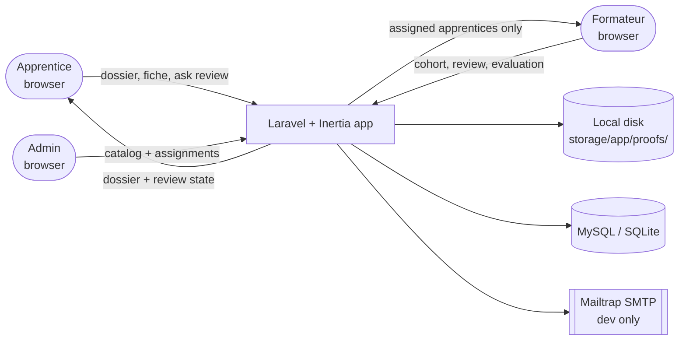
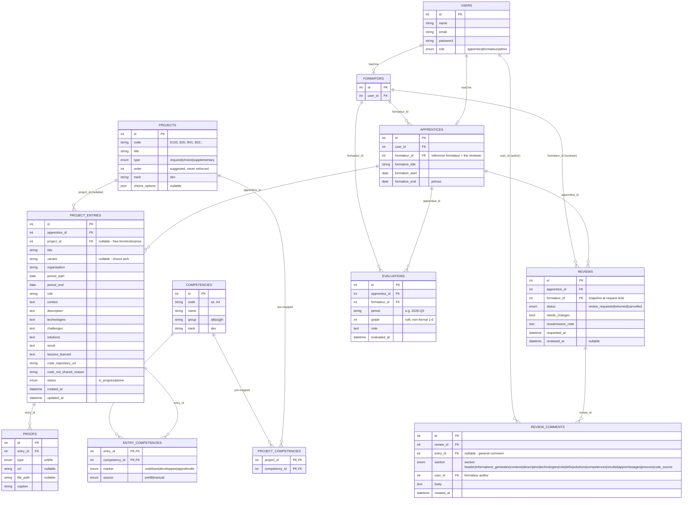

# Architecture — Dossier de formation (Plan D)

**Status:** derived from `.scratch/DOSSIER_FORMATION/spec.md` (final revised spec).

## System overview



The DB is the **only** system of record: entries, fiches, reviews, comments, evaluations. All derived values — light-diff flags (`new|changed|unchanged`), "recently reviewed", the cohort gate, "current project" — are computed **on read** from `REVIEWS` + `updated_at`; nothing is cached or snapshotted, which is fine at demo scale (one formateur, a handful of apprentices, tens of entries).

Deliberately absent: no queue worker, no cron, no WebSockets, no OAuth, no external API beyond Mailtrap SMTP. The single outbound call is the notification email. Everything else happens synchronously inside one Laravel request.

## Database schema



`users` is the sole authentication table; `apprentices`/`formateurs` are one-to-one profile rows off `role` (admin has no profile). `APPRENTICES.formateur_id` is both the review authority and the scoping key (see Authorization below). `PROJECT_ENTRIES.status` is deliberately coarse — review state lives in `REVIEWS`, never duplicated on the entry, so "auto-cancel on edit" is just a transition, not a consistency problem. `REVIEW_COMMENTS.section` is an enum matching the brief's fixed fiche sections, so pinned comments can't orphan.

## Request flow: apprentice asks for review

```
1. Apprentice opens a done fiche and clicks "ask review"
2. POST /review-requests  (ReviewRequestController@store)
     ├─ EntryPolicy: apprentice owns the entry
     ├─ ReviewService::ask()  — Rejects if an outstanding `review_requested` review exists
     │                          (throttle: one per apprentice)
     │                       — Creates a REVIEWS row: status `review_requested`,
     │                          formateur_id = apprentice's reference formateur (snapshot)
     └─ Sends ReviewRequested Mailable to the formateur (Mailtrap in dev) + dashboard flag
3. Redirect to the dossier overview — the entry's derived state is now "under review"
```

## Request flow: formateur reviews and submits

```
1. Formateur opens the review from the cohort dashboard or the request email
2. GET /formateur/reviews/{review}  (ReviewController@show)
     └─ ReviewPolicy: formateur_id === current formateur's id (403 otherwise)
     └─ Dossier rendered with light-diff flags per entry:
          new | changed (entry.updated_at > reviewed_at of latest returned review) | unchanged
     └─ ReviewComment::where('review_id')->with(entry, author) eager-loaded
3. POST /reviews/{review}/comments  (adds a section-pinned or general comment, formateur author)
4. POST /reviews/{review}/submit    (ReviewService::submit)
     ├─ sets status `returned`, reviewed_at = now, needs_changes = verdict
     └─ sends ReviewSubmitted Mailable to the apprentice + dashboard flag
5. Redirect to cohort dashboard — apprentice's "last review" now shows; "recently reviewed"
   indicator (window, default 14 days) appears where relevant
```

Everything synchronous in one request; no background jobs (a queue for email is a reasonable later optimization, pointless at demo scale).

## Request flow: apprentice edits a fiche (the auto-cancel path)

```
1. Apprentice edits any fiche field, adds/removes a proof or a competency, or deletes the entry
2. PUT/DELETE /entries/{id}  (EntryController@update / destroy)
     ├─ EntryPolicy: owner only
     ├─ FicheService::update/destroy:
     │    - persists the mutation
     │    - ReviewService::cancelIfPending(apprentice)  — sets any outstanding
     │      `review_requested` review to `cancelled` (single-threaded, race-safe)
     └─ entry.status reset to `in_progress` (if it was `done`)
3. Redirect to the fiche — the apprentice can re-ask review once they're done
```

This is the guarantee that a formateur never reviews a moving target: an outstanding request is cancelled by *any* mutation, including deletion, so a review never outlives its subject.

## Request flow: formateur cohort dashboard and evaluation

```
1. GET /formateur/apprentices  (CohortController@index)
     └─ Apprentice::where('formateur_id', $me)  (query-layer scoping)
     └─ per apprentice, computed on read:
          remaining catalog projects (> 0 gates the "current project" row)
          current project      = the entry with status `in_progress` (latest)
          pending review       = a REVIEWS row with status `review_requested`
          last review          = reviewed_at of the latest `returned` review
2. GET /formateur/apprentices/{apprentice}/evaluations  (EvaluationController@index)
3. POST /evaluations  (EvaluationController@store)
     ├─ ReviewPolicy/EvalPolicy: formateur_id === $me, apprentice.formateur_id === $me
     ├─ upsert EVALUATIONS row for (apprentice_id, period): grade + note
     └─ apprentice sees it on their own dossier overview
```

## Component map

```
app/
├── Http/Controllers/
│   ├── EntryController.php          # fiche CRUD + proofs (apprentice, owner-scoped)
│   ├── ReviewRequestController.php  # ask / cancel review (apprentice, owner-scoped)
│   ├── ReviewController.php         # show review + comments + submit (formateur, assigned-scoped)
│   ├── CohortController.php         # formateur dashboard (assigned-scoped)
│   └── EvaluationController.php     # quarterly evaluation (formateur, assigned-scoped)
├── Models/                          # User, Apprentice, Formateur, Project, Competency,
│                                    # ProjectEntry, EntryCompetency (pivot), Proof, Review,
│                                    # ReviewComment, Evaluation
├── Policies/
│   ├── EntryPolicy.php              # apprentice: own only
│   ├── ReviewPolicy.php             # formateur: assigned apprentices' reviews only
│   └── EvaluationPolicy.php         # formateur: assigned apprentices' evaluations only
├── Mail/
│   ├── ReviewRequested.php          # to the formateur
│   ├── ReviewSubmitted.php          # to the apprentice
│   └── EvaluationRecorded.php       # to the apprentice (optional)
└── Services/
    ├── FicheService.php             # create/update, metadata prefill (catalog/competencies/variant),
    │                                # auto-cancel on mutation + deletion, no prose generation
    ├── ReviewService.php            # ask (throttle), cancel, auto-cancel, submit,
    │                                # changed-flags derivation (new/changed/unchanged)
    └── MarkdownExporter.php         # dossier header + sommaire + fiches -> markdown (brief template)
database/
├── migrations/                      # users, apprentices, formateurs, projects, competencies,
│                                    # project_competencies, project_entries, entry_competencies,
│                                    # proofs, reviews, review_comments, evaluations
└── seeders/                         # DemoUsersSeeder (incl. 2 disjoint formateurs),
                                    # ProjectCatalogSeeder, CompetencyCatalogSeeder,
                                    # CompetencyMappingSeeder
resources/js/Pages/
├── Auth/Login.jsx
├── Dossier/
│   ├── Overview.jsx                 # header (name/formation/period) + sommaire + entry list
│   ├── EntryForm.jsx                # 12-section fiche editor, section anchors, incremental save
│   └── EntryShow.jsx                # read-only fiche (formateur view reuses this)
├── Reviews/ReviewShow.jsx           # formateur review: flags + section-pinned/general comments + verdict
└── Formateur/
    ├── CohortDashboard.jsx          # apprentices: gate, current project, pending, last review
    └── Evaluations.jsx              # quarterly grade + note entry and history
```

Absent by decision: `Jobs/`, `Exports/`, `Notifications` (dashboard flags + email only), any real-time component, any cache layer.

## Authentication and roles

One `users` table is the authentication boundary. `users.role` is an enum (`apprentice | formateur | admin`); each non-admin user has exactly one profile row via `hasOne` (`auth()->user()->apprentice` / `->formateur`). `admin` has no profile. Login is role-agnostic; the post-login redirect branches on role — apprentice → `Dossier/Overview`, formateur → `Formateur/CohortDashboard`, admin → catalog management.

## Authorization and scoping

Two roles read the same tables through different scopes, enforced at the **query layer** so a hand-crafted URL can't walk around them:

- **Apprentice** — `Entry::where('apprentice_id', $me->id)`; another apprentice's entry, review, or evaluation is a 403 via `EntryPolicy`/`ReviewPolicy`, not a filtered-but-reachable row. The fiche editor never shows someone else's content.
- **Formateur** — `Apprentice::where('formateur_id', $me->id)` for the cohort; every review/evaluation write re-checks `formateur_id` server-side. An apprentice outside that set is a 403.
- **Admin** — catalog + assignment writes only; no dossier read/write.

Hiding an option in the UI is never treated as enforcement; each boundary is feature-tested with 403 assertions, and the demo seed ships two formateurs with disjoint apprentices so the boundary is visible in the demo itself.

## Review derivation (the headline computed behavior)

```
for each entry in the apprentice's dossier (formateur opens a review):
    baseline  = reviewed_at of the apprentice's latest `returned` review, or none
    flag      = none            -> new          (first review: everything is new)
              | entry.updated_at > baseline     -> changed
              | otherwise                       -> unchanged
```

Inputs: entry `updated_at`, latest `returned` review's `reviewed_at`. Output: per-entry flag driving the review UI's attention-focusing. Computed on read inside `ReviewService::changedFlags()`; no snapshots, no diff storage. Tested against fixtures for the three flag states including the first-review case (see Testability).

## Deployment shape

Single Laravel app, single DB (MySQL/SQLite), local filesystem for proof uploads. No queue worker, no cron, no WebSockets server, no external API keys except Mailtrap SMTP credentials in dev. Smallest deployable shape that still holds a real dossier, runs the review loop, and enforces a genuine two-role authorization boundary.

## Testability

- **Pure services, unit-tested against real values:** `ReviewService` state transitions (ask-throttle, cancel, auto-cancel on fiche mutation/proof/competency change/deletion, submit sets `reviewed_at` + verdict) and the light-diff derivation (new/changed/unchanged incl. first review) — the highest-value tests in the suite, they guard the thesis feature; `MarkdownExporter` against the brief's dossier template (header + sommaire + fiche); `FicheService` metadata prefill against mapping fixtures.
- **Feature-tested through the real HTTP pipeline:** fiche CRUD + proof upload validation + authorized serving route; ask-review → throttle → edit auto-cancels → re-ask with resubmission note; deletion with a pending review cancels; comment pinning (section enum) + verdict; cohort gate (remaining > 0, all years); authorization 403s across the two seeded formateurs; evaluation create/list.
- **Offline by design:** no external service in the suite; email via `Mail::fake()` (Mailtrap is a dev-time eyeball tool, not a CI dependency); proof storage confined to the test disk.
