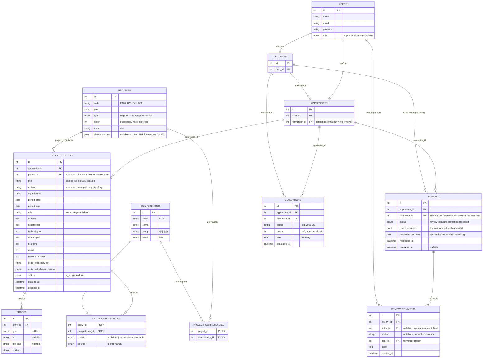

# Spec: Dossier de formation — Plan A (baseline)

**Status:** proposal — frozen baseline, first honest pass. Corrections land in `review.md`, revised final in `spec.md`.
**Source:** brainstorm.md (Projet 3, `new-ideas` branch), official brief `context/projet-3/Création et maintenance du dossier de formation.md` (JT_DEV_B09_1.5), the canevas xlsx (`Projets entreprise` + competency catalog), and a full grilling session with the team (2026-08-14) that resolved the open questions up front.

## Thesis / Overview

A portfolio tracker for the Jobtrek **dossier de formation** — the formal, mandatory deliverable (`JT_DEV_B09_1.5`) in which an apprentice records every project and the competencies it mobilized. The apprentice maintains a structured fiche per project, following the brief's prescribed template; the **formateur reviews it through an in-app loop** ("ask review" → annotate → iterate). The fiche + review loop are the product. A formateur cohort view (which apprentice is on which catalog project) is a feature on top, not a second product.

The app is the system of record, replacing the brief's "recommended" Markdown + Git + GitHub Pages template with its own display and a **markdown export** for printing/portability. This is a portfolio tracker — the learning/training-guide side of the original idea is explicitly out of scope (separate project).

## User stories

**Apprentice.** I log in and see my dossier — the list of my project fiches. I claim a Jobtrek catalog project (say B52) or add a free-form enterprise project; the app prefills the competency section from the project's documented mapping, and records my choice (e.g. Symfony) when the project is a choice. I fill the fiche's sections across time. When a fiche is done, I ask the formateur for a review; I can cancel or edit freely (editing cancels any pending review so the formateur never reviews a moving target). When the review comes back with annotations and a "needs changes" verdict, I fix the sections they pinned, attach a short resubmission note, and re-ask. I can export any fiche or the whole dossier to markdown.

**Formateur.** I log in and land on a cohort dashboard: my apprentices, their current project, whether a review is pending, and the last review date. When an apprentice asks for review I open their dossier with the changed fiches/sections flagged since my last review; I comment per-section or in general, and I submit with an explicit "needs changes / ok" verdict. Every quarter I record a soft, non-formal evaluation (a grade + advisory note) per apprentice, which they can see as their progress overview.

**Admin.** I seed and maintain the project catalog, the competency catalog, and the project→competency mappings (the "feuille de projet" data), and I assign each apprentice their reference formateur.

## Data model



Notes on the non-obvious bits:

- **`PROJECTS` / `COMPETENCIES` / `PROJECT_COMPETENCIES` are seeded catalog data**, read from the canevas xlsx and — for the pre-mapping, the "special section" — from the project briefs (feuilles de projet). This mapping is the headline data risk (see Risks). Seeded per-track (`track = dev`); the catalog shape is data-driven so other formations slot in later without a schema change, but only DEV ships in the MVP.
- **`PROJECT_ENTRIES.status` is coarse** — `in_progress` (claimed / being filled) or `done` (fiche complete). Everything about review state is *derived from `REVIEWS`* + `updated_at`, not stored on the entry: "under review" (a `review_requested` review exists), "reviewed" (latest `returned` review after `updated_at`), "needs review" (edited since last `returned` review). This keeps the light-diff feature a read-time computation with no snapshots.
- **The review is whole-dossier, one `REVIEWS` row per request** — not per fiche. The light diff flags which entries/sections changed since the formateur's last `returned` review.
- **`ENTRY_COMPETENCIES`** is the fiche's "Compétences mobilisées" — a many-to-many with a three-way marker (`mobilisée` / `développée` / `approfondie`, per the brief) and a `source` recording whether it came from the catalog prefill or was added by hand.
- **`PROOFS`** covers the brief's proof requirements as either a URL (demo link, hosted version) or an uploaded image (screenshot) stored locally. The code source is a dedicated pair of fields on the entry (`code_repository_url` / `code_not_shared_reason`), matching the brief's "repo link or say why not".
- `USERS.role = admin` has no profile row (same pattern as the grade-manager plan). `APPRENTICES.formateur_id` is the single reviewer authority and the scoping key.

## Review derivation (the headline computed behavior)

The "light diff" is what makes a whole-dossier review palatable. It is deliberately not a GitHub-style field diff — it is a read-time flag, computed per entry when the formateur opens a review:

```
for each entry in the apprentice's dossier:
    changed = entry.updated_at > reviewed_at(last returned review)   # first review: everything is "new"
    flag entry as:  new | changed | unchanged
```

No snapshots, no per-field history, no diff renderer. The formateur sees the whole dossier but is steered to the flagged entries and, within them, to the pinned comment sections. This is the "light" model chosen over a field-level diff because a simple review at this level does not justify a versioning/diff subsystem.

## Tech stack

| Layer | Choice |
|-------|--------|
| Backend | Laravel 12 |
| Frontend | React 19 via Inertia.js |
| Styling | Tailwind CSS |
| Auth | Laravel built-in auth; `users.role` enum + `hasOne` profile; seeded demo users, no register |
| Authorization | Laravel Policies (`EntryPolicy`, `ReviewPolicy`, `EvaluationPolicy`) |
| File storage | Local (`storage/app/proofs/`) |
| Email | Laravel Mail (Mailable), Mailtrap SMTP in dev/test |
| Markdown export | Plain PHP string builder rendering the brief's fiche template (no library) |

Same stack as the grade-manager plan (Plan D) — consistent with the team's experience and the repo.

## Architecture

```
second-group-project/
├── app/
│   ├── Http/Controllers/
│   │   ├── EntryController.php          # fiche CRUD + proofs (apprentice)
│   │   ├── ReviewRequestController.php  # ask review / cancel (apprentice)
│   │   ├── ReviewController.php         # review view + comments + submit (formateur)
│   │   ├── CohortController.php         # formateur dashboard
│   │   └── EvaluationController.php     # quarterly evaluation (formateur)
│   ├── Models/                          # User, Apprentice, Formateur, Project, Competency,
│   │                                    # ProjectEntry, EntryCompetency (pivot), Proof, Review,
│   │                                    # ReviewComment, Evaluation
│   ├── Policies/                        # EntryPolicy, ReviewPolicy, EvaluationPolicy
│   ├── Mail/                            # ReviewRequested, ReviewSubmitted, EvaluationRecorded
│   └── Services/
│       ├── FicheService.php             # create/update, prefill (catalog/competencies/variant), status rules
│       ├── ReviewService.php            # ask (throttle), cancel, auto-cancel on edit, submit, changed-flags
│       └── MarkdownExporter.php         # fiche / dossier -> markdown (brief template)
├── database/migrations/
├── database/seeders/                    # DemoUsersSeeder, ProjectCatalogSeeder,
│                                        # CompetencyCatalogSeeder, CompetencyMappingSeeder
├── resources/js/Pages/
│   ├── Auth/
│   ├── Dossier/                         # Overview.jsx, EntryForm.jsx, EntryShow.jsx
│   ├── Reviews/                         # ReviewShow.jsx (formateur)
│   └── Formateur/                       # CohortDashboard.jsx, Evaluations.jsx
└── storage/app/proofs/
```

## MVP scope

### In
- Seeded demo users (apprentice, formateur, admin), simple auth, no register; `users.role` + profiles wired to policies
- Catalog seeding from the canevas: 15 DEV projects (code/title/type/order/choice_options), competency catalog (a–h), project→competency pre-mapping (from the feuilles de projet)
- Fiche: claim a catalog project (prefill: title, competencies "special section", choice variants) or create a free-form enterprise entry; edit the full 12-section fiche; add proof URLs + screenshot images (local storage); code source URL or not-shared reason
- Apprentice dossier overview: entry list, current project, markdown export per fiche and per dossier
- Review loop: ask review (one outstanding request per apprentice, cancellable; editing auto-cancels), formateur review with light-diff flags, section-pinned + general comments, `needs_changes` verdict, submit, "recently reviewed" indicator, apprentice resubmission note on re-ask
- Formateur cohort dashboard: apprentices with remaining catalog projects (gate = `remaining catalog projects > 0`, all years eligible), current project, pending review, last review
- Quarterly evaluation: formateur records a soft grade + advisory note per apprentice per quarter; apprentice sees their own evaluations
- Notifications: in-app + email (Mailtrap in dev) on review requested / review submitted
- Test strategy (below) — a review-loop lifecycle suite, not just happy-path CRUD

### Out
- Order enforcement, dependency graph, locks — **cut**: catalog order is guidance; choice/reorderability is recorded as data (`variant`), never gated (decision from the grilling)
- Learning-tool features (project brief distribution, guides, "download the project file") — **cut**, a separate project by decision
- Standalone competency logging (a competency entry with no fiche) — **deferred**: real need ("certains apprentis remplissent le dossier indépendamment des projets") but a supplementary phase; the `ENTRY_COMPETENCIES` pivot already generalizes to it, so it's small to add later
- Multi-track catalogs (other CFC formations) — **deferred**: data-driven design, only the DEV seed ships
- Two-way comment threads — **cut**: model is trainer→apprentice one-way plus a resubmission note; questions happen verbally, by design (values human contact, per the grilling)
- Full GitHub Pages / git integration — **cut**: replaced by markdown export
- Proofs beyond URL + screenshot image (documents, video) — **cut** for MVP
- Real-time anything (WebSockets, push) — **absent**: the demo is single-session; polling/refresh is enough

## Risks

| Risk | Mitigation |
|------|------------|
| **Project→competency pre-mapping (the "special section") is guessable data.** The prefill is the main reason the fiche isn't a burden, but the mapping has to come from the feuilles de projet, and guessing it would poison every fiche that uses it. | Read the feuilles de projet in week 1, encode the mapping as test fixtures *before* writing `FicheService`. Prefill is additive and editable — an incomplete mapping degrades gracefully to an empty picker, never a wrong answer. |
| **The review loop is the biggest bespoke build** — throttle, auto-cancel, comments (pinned + general), verdict, light-diff flags, resubmission note. A "faithful" version (per-field diffs, snapshots, full diff rendering) blows the budget. | The light model is the good-enough model: flags computed on read, no snapshots. Cut list in Workstream below protects this before anything else. |
| **"Form vs tracker" relapse** — scope drifts back toward a curriculum/planning product (order enforcement, schedules, prerequisites) because the catalog makes it tempting. | The catalog's only product surface is the cohort dashboard's current-project read; everything else is dossier. The decision table in `spec.md` records the cut. |
| **Quarterly evaluation creeps into a grading system** — the soft estimate becomes a CFC-grade substitute with history graphs and averages. | MVP is one row per quarter: grade + note, no aggregation, no graphs. Marked as a decision, not an accident. |
| **A 12-section fiche is a big form** — data-entry burden that silently discourages use, which defeats the point of the dossier. | Prefill (catalog metadata, competency special section, variant) + single-page edit with section anchors; the fiche is saved incrementally, not submitted atomically. |
| **Team learning curve** — Laravel 12 + Inertia + React 19 + policies is new territory if the team hasn't shipped it before. | Weeks 1–2 are partly tutorial time; budgeted below. |
| **Scoping leaks: a formateur reading another's apprentice, or an apprentice viewing another's dossier** | Policies enforced at the query layer (`Apprentice::where('formateur_id', $me)`), explicitly feature-tested with 403s. |

## Workstream split (4 devs, 6 weeks)

Week 1 is **not** parallel — every stream depends on the schema, the auth/role model, and the seeded catalogs.

| Week | Plan |
|------|------|
| 1 | **All four together:** migrations, `users` + role + profiles, policies skeleton, seeders; transcribe catalog + competencies + **project→competency mapping into fixtures** (read the feuilles de projet). Ends with a schema and a seed nobody changes. |
| 2–3 | **A:** fiche create/edit + proofs (URL + upload) · **B:** catalog service + competency prefill + choice variant · **C:** review loop (ask/cancel/auto-cancel/submit/comments/light-diff flags) · **D:** formateur cohort dashboard + evaluations + markdown export |
| 4–5 | Notifications, integration, authorization + review-lifecycle feature tests |
| 6 | Polish, demo script, buffer |

Fallback floor if a stream slips: cut image upload → URLs only; cut quarterly evaluations; cut markdown export to per-fiche only. Never cut the review loop or the prefill — those are the thesis.

## Test strategy

- Unit: `ReviewService` state transitions (ask with one outstanding rejected, cancel, auto-cancel on edit/delete, submit sets `reviewed_at` + verdict), light-diff derivation (new/changed/unchanged flags, first-review-everything-new), `FicheService` competency prefill against mapping fixtures, `MarkdownExporter` against the brief's fiche template
- Feature: fiche CRUD + proofs; ask-review → throttle → edit auto-cancels → re-ask with resubmission note; formateur comments (pinned + general) + `needs_changes` verdict; cohort gating (only apprentices with remaining catalog projects); formateur scoping 403s (other formateur's apprentice); evaluation create/list; apprentice sees only their own dossier
- Explicitly untested / offline: no external services in the suite; email via `Mail::fake()` (Mailtrap is a dev-time eyeball tool, not a CI dependency); no live proofs storage beyond the test storage disk

## Open questions (ordered by how much each blocks)

1. **Are the feuilles de projet available to read?** The pre-mapping fixtures in week 1 depend on them. If they aren't, the fallback is an empty mapping + additive prefill (already the graceful-degradation path), but the demo story loses the prefill wow. Blocks the seed and `FicheService`.
2. **Quarterly grade scale** — a 1–6 integer per the Swiss convention, or a qualitative short scale (en progrès / stable / à renforcer)? Blocks the `EVALUATIONS.grade` type. Lean: 1–6 int, free-text note carries the nuance.
3. **Notification channel** — in-app only, or in-app + email? Blocks the `Mail/` package scope. Lean: both, Mailtrap in dev.
4. **"Starting the next project"** — the brainstorm's workflow has the apprentice tell the formateur a new project is starting. Is claiming a catalog project notification-worthy, or just a status change? Lean: light in-app notification, cut-able.
5. **Team-size/stack confirmation** — 4 devs / 6 weeks and the Laravel 12 + Inertia + React 19 stack are assumed from the other projects; the workstream table depends on the first.

## Next steps

1. Read the feuilles de projet (Open Question #1) and transcribe catalog + competencies + mapping into test fixtures — this is week 1's data gate, same rule as the grade-manager's weighted average
2. Resolve Open Questions #2–#4 (small, but they touch schema and the Mail package)
3. Week 1 group spike: schema, `users` + role + profiles, policies skeleton, seeders
4. Split per the workstream table
