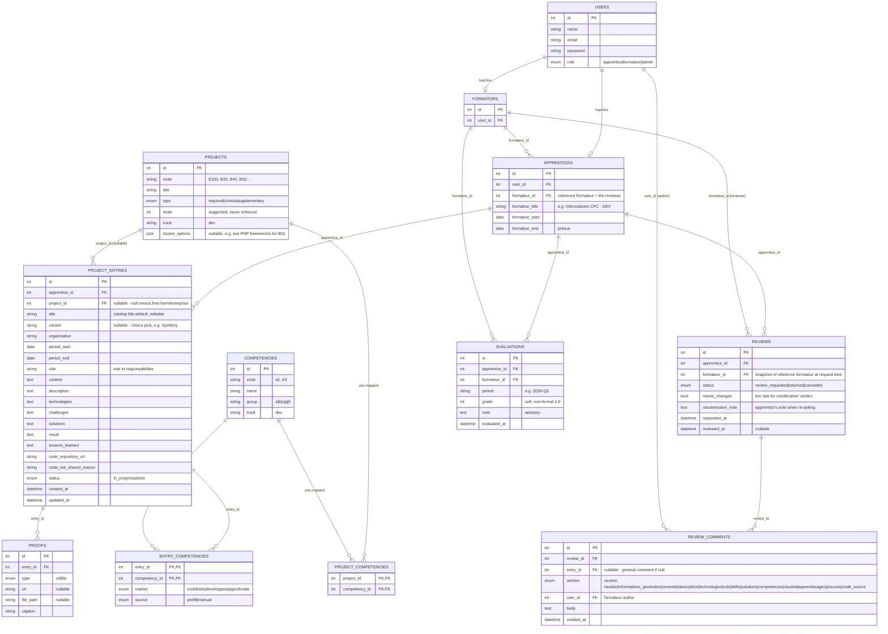

# Spec: Dossier de formation — Plan D (final revised)

**Status:** planning complete — final working plan, revised after the review pass.
**Source:** baseline `.scratch/DOSSIER_FORMATION/spec-v1.md`, review `.scratch/DOSSIER_FORMATION/review.md`. All eight review corrections adopted — see "Corrections adopted" below.

## Thesis / Overview

A portfolio tracker for the Jobtrek **dossier de formation** — the formal, mandatory CFC deliverable (`JT_DEV_B09_1.5`) in which an apprentice records every project and the competencies it mobilized. The apprentice maintains a structured fiche per project following the brief's prescribed template; the **formateur reviews it through an in-app loop** ("ask review" → annotate → iterate). The fiche + review loop are the product; a formateur cohort view (which apprentice is on which catalog project) is a feature on top.

The app is the system of record — its own display plus a **markdown export** for printing/portability — replacing the brief's "recommended" Markdown + Git + GitHub Pages template. The tool **never generates fiche prose**: it prefills metadata (title, competencies, choice variant); the body text is the apprentice's own, per the brief's §4.6 on AI use. This is a portfolio tracker — the learning/training-guide side is out of scope (separate project).

## User stories

**Apprentice.** I log in and see my dossier — the list of my project fiches with the dossier header (name, formation, period, sommaire). I claim a Jobtrek catalog project (say B52) or add a free-form enterprise project; the app prefills the competency section from the project's documented mapping, and records my choice (e.g. Symfony) when the project is a choice. I fill the fiche's sections across time. When a fiche is done I ask the formateur for a review; I can cancel or edit freely — any edit cancels a pending review so the formateur never reviews a moving target. When the review comes back with pinned annotations and a "needs changes" verdict, I fix those sections, attach a short resubmission note, and re-ask. I can export any fiche or the whole dossier to markdown.

**Formateur.** I log in and land on a cohort dashboard: my apprentices, their current project, pending review, and last review date. When an apprentice asks for review I open their dossier with the changed fiches flagged since my last review; I comment per-section (against the brief's fixed section list) or in general, and I submit with an explicit "needs changes / ok" verdict. Every quarter I record a soft, non-formal evaluation (grade + advisory note) per apprentice, which they can see as their progress overview.

**Admin.** I seed and maintain the project catalog, the competency catalog, and the project→competency mappings (the "feuille de projet" data), and I assign each apprentice their reference formateur.

## Decisions taken (grilling + review pass)

| # | Question | Decision |
|---|----------|----------|
| 1 | Product identity | **Portfolio tracker.** The learning/training-guide side is a separate project, out of scope |
| 2 | System of record | **App DB + own display**, markdown export for portability; replaces the GitHub Pages template |
| 3 | Project model | **Hybrid**: seeded Jobtrek catalog as a picker (prefill) + free-form enterprise/other entries |
| 4 | Competency model | Seeded `a–h` catalog; **pre-mapped "special section" for Jobtrek projects only** (sourced from the feuilles de projet, additive/editable); manual for enterprise/other; standalone logging deferred |
| 5 | Catalog scope | **DEV-only seed**, data-driven shape so other formations slot in later without redesign |
| 6 | Review granularity | **Whole-dossier review**, one `REVIEWS` row per request; light diff flags which fiches/sections changed |
| 7 | Diff model | **Light** — read-time flags (`new | changed | unchanged`), no snapshots, no field-level diff renderer |
| 8 | Comment model | **(B)** trainer→apprentice one-way comments (section-pinned + general) + apprentice **resubmission note** on re-ask; no reply threads — questions happen verbally, by design |
| 9 | Lifecycle | Entry status is coarse (`in_progress | done`); review state is **derived** from `REVIEWS` + `updated_at` |
| 10 | Ordering | **Suggested order only** — catalog order/choice/supplementary are data, never enforced, no locks |
| 11 | Cohort dashboard | Formateur's; gated by `remaining catalog projects > 0` (all years eligible); current project + pending review + last review |
| 12 | Quarterly evaluation | Minimal: one row per quarter (grade + note), no aggregation, no graphs; not a grading system |
| 13 | Proofs | URL or locally-stored image; code source = URL or not-shared reason; served through an authorized route |
| 14 | Notifications | Dashboard flags + email (Mailtrap dev); **no notifications table** |

## Corrections adopted (from `review.md`)

| # | Correction | Where it landed |
|---|------------|-----------------|
| 1 | Dossier header block (§3.1) in the data model + export | `APPRENTICES.formation_*`; "Dossier header" below; markdown export |
| 2 | Pin the two derivations (gate "remaining"; "recently reviewed" window) | "Rules" section |
| 3 | Auto-cancel covers any entry mutation + deletion; single-threaded through `ReviewService` | "Rules" + `ReviewService` |
| 4 | `REVIEW_COMMENTS.section` constrained to the brief's fixed section list | Data model + validation |
| 5 | Authorization matrix explicit; seed ≥2 formateurs with disjoint apprentices | "Authorization" + seeders |
| 6 | Notifications resolved: dashboard flags + email, no table | Decision #14, "MVP scope" |
| 7 | No-prose-generation rule stated | "Thesis", "Rules" |
| 8 | Proof files validated + served via authorized route | "Rules", "Test strategy" |

## Data model



Notes on the non-obvious bits:

- **`APPRENTICES.formation_*`** carries the brief §3.1 header block — the dossier overview and the markdown export render name + formation + period + sommaire from it (review correction #1).
- **`REVIEW_COMMENTS.section` is now an enum** matching the brief's fiche sections — pinned comments can't silently orphan on a typo (review correction #4).
- **`PROJECT_ENTRIES.status` is coarse** (`in_progress | done`). Review state is derived from `REVIEWS` + `updated_at`, never stored on the entry.
- **`ENTRY_COMPETENCIES`** records the three-way marker (`mobilisée | développée | approfondie`) per the brief, plus `source` (prefill from the catalog mapping vs. manual).
- **`PROOFS`** holds proof URLs or uploaded images (local disk); the code source is the dedicated `code_repository_url` / `code_not_shared_reason` pair.
- Seeded catalog (`PROJECTS`, `COMPETENCIES`, `PROJECT_COMPETENCIES`) is DEV-track, data-driven for later formations.

## Rules (the derived and enforced behaviors)

1. **Light-diff derivation.** When the formateur opens a review, flag each entry: `new` on the first review (nothing reviewed yet); `changed` when `entry.updated_at > reviewed_at` of the apprentice's latest `returned` review; `unchanged` otherwise. Read-time, no snapshots.
2. **Cohort gate.** An apprentice appears in the formateur's "current project" cohort when `remaining catalog projects > 0`, where *remaining* = catalog projects with **no entry at all** for that apprentice. All years eligible — the catalog is never locked out.
3. **"Recently reviewed" indicator.** Derived from `reviewed_at` of the latest `returned` review within a fixed configurable window (default 14 days). Never stored.
4. **Auto-cancel on mutation.** Any mutation of an entry's content — fiche fields, proofs (add/delete), competencies — **or deletion of the entry** cancels an outstanding `review_requested` review (sets it `cancelled`). All transitions go through `ReviewService` so a two-tab race can't review a moving target.
5. **Throttle.** One outstanding `review_requested` review per apprentice. Asking again while one is pending is rejected; the apprentice can cancel or edit freely.
6. **No prose generation.** `FicheService` prefills metadata only (title, competencies, variant, catalog defaults). Body sections are the apprentice's own text; the tool offers no text generation or suggestion (brief §4.6).
7. **Proof serving.** Uploaded proof images are validated (type/size) and served through a policy-gated route, never a public disk path.

## Authorization (enforced at the query/policy layer, not UI-hidden)

| Role | Apprentice dossiers | Reviews / comments | Evaluations | Catalog & assignments |
|------|---------------------|--------------------|-------------|------------------------|
| **apprentice** | read/write **own** entries; ask/cancel own reviews | read own reviews + comments (no write) | read **own** | none |
| **formateur** | read **assigned** apprentices' entries (no write) | write reviews/comments for **assigned** apprentices | write for **assigned** apprentices | none |
| **admin** | none | none | none | seed/maintain catalog + mapping; assign formateurs |

Enforcement: `Apprentice::where('formateur_id', $me)` scopes every formateur query; `GradePolicy`-style policies reject by 403, not by filtering-and-hiding. The demo seed includes **two formateurs with disjoint apprentices** so the boundary is demonstrable.

## Tech stack

| Layer | Choice |
|-------|--------|
| Backend | Laravel 12 |
| Frontend | React 19 via Inertia.js |
| Styling | Tailwind CSS |
| Auth | Laravel built-in auth; `users.role` enum + `hasOne` profile; seeded demo users, no register |
| Authorization | Laravel Policies (`EntryPolicy`, `ReviewPolicy`, `EvaluationPolicy`) |
| File storage | Local (`storage/app/proofs/`), served via authorized routes |
| Email | Laravel Mail (Mailable), Mailtrap SMTP in dev/test; `Mail::fake()` in tests |
| Markdown export | Plain PHP string builder rendering the brief's dossier template (header + sommaire + fiches), no library |

## Architecture

```
second-group-project/
├── app/
│   ├── Http/Controllers/
│   │   ├── EntryController.php          # fiche CRUD + proofs (apprentice)
│   │   ├── ReviewRequestController.php  # ask review / cancel (apprentice)
│   │   ├── ReviewController.php         # review view + comments + submit (formateur)
│   │   ├── CohortController.php         # formateur dashboard
│   │   └── EvaluationController.php     # quarterly evaluation (formateur)
│   ├── Models/                          # User, Apprentice, Formateur, Project, Competency,
│   │                                    # ProjectEntry, EntryCompetency (pivot), Proof, Review,
│   │                                    # ReviewComment, Evaluation
│   ├── Policies/                        # EntryPolicy, ReviewPolicy, EvaluationPolicy
│   ├── Mail/                            # ReviewRequested, ReviewSubmitted, EvaluationRecorded
│   └── Services/
│       ├── FicheService.php             # create/update, metadata prefill, auto-cancel on mutation
│       ├── ReviewService.php            # ask (throttle), cancel, auto-cancel, submit, changed-flags
│       └── MarkdownExporter.php         # dossier header + sommaire + fiches -> markdown
├── database/migrations/
├── database/seeders/                    # DemoUsersSeeder (2 formateurs, disjoint apprentices),
│                                        # ProjectCatalogSeeder, CompetencyCatalogSeeder,
│                                        # CompetencyMappingSeeder
├── resources/js/Pages/
│   ├── Auth/
│   ├── Dossier/                         # Overview.jsx (header + sommaire + list), EntryForm.jsx,
│   │                                    # EntryShow.jsx
│   ├── Reviews/                         # ReviewShow.jsx (formateur)
│   └── Formateur/                       # CohortDashboard.jsx, Evaluations.jsx
└── storage/app/proofs/
```

## MVP scope

### In
- Seeded demo users (apprentice ×several, 2+ formateurs with disjoint apprentices, admin), simple auth, no register; `users.role` + profiles wired to policies
- Catalog seeding from the canevas + feuilles de projet: 15 DEV projects, `a–h` competency catalog, project→competency pre-mapping
- Dossier header block (formation title/period, sommaire) on the overview and in the export
- Fiche: claim a catalog project (prefill title/competencies/variant) or create a free-form enterprise entry; edit the 12-section fiche; proof URLs + screenshot uploads (local); code source URL or not-shared reason; auto-cancel on any mutation
- Review loop: ask (throttle, cancellable, auto-cancel on mutation/deletion), formateur review with light-diff flags + section-pinned/general comments + `needs_changes` verdict + submit, "recently reviewed" indicator, resubmission note
- Formateur cohort dashboard: remaining-catalog gate, current project, pending review, last review
- Quarterly evaluation: formateur records grade + note per apprentice per quarter; apprentice sees own
- Notifications: dashboard flags + email (Mailtrap dev) on review requested / review submitted
- Markdown export: per fiche and whole dossier (header + sommaire + fiches)
- Test strategy below — review-loop lifecycle and authorization matrix, not just CRUD

### Out
- Order enforcement, dependency graph, locks — **cut**: suggested order only; choice/reorderability is data (`variant`), never gated
- Learning-tool features (project brief distribution, guides) — **cut**, separate project by decision
- Standalone competency logging (no fiche) — **deferred**: real need, supplementary phase; the `ENTRY_COMPETENCIES` pivot already generalizes to it
- Multi-track catalogs — **deferred**: data-driven shape, DEV seed only
- Two-way comment threads — **cut**: one-way + resubmission note; questions are verbal by design
- GitHub Pages / git integration — **cut**: replaced by markdown export
- Proofs beyond URL + screenshot image — **cut**
- Real-time anything — **absent**
- A notifications table — **cut**: dashboard flags + email are enough

## Risks

| Risk | Mitigation |
|------|------------|
| **Project→competency pre-mapping (the "special section") is guessable data** — the prefill's value depends on it, and guessing poisons every fiche that uses it. | Read the feuilles de projet in week 1, encode as test fixtures *before* writing `FicheService`. Prefill is additive and editable; incomplete mapping degrades to an empty picker, never a wrong answer. |
| **Review-loop state interactions** (throttle × auto-cancel × deletion × resubmission) hide two-tab race bugs. | All transitions single-threaded through `ReviewService`; every state transition feature-tested including the negative cases. |
| **"Form vs tracker" relapse** — scope drifts back to a planning product because the catalog tempts it. | Catalog's only product surface is the cohort gate + current-project read; decision #10 records the cut. |
| **Quarterly evaluation creeps into a grading system** — history, averages, CFC-grade substitution. | One row per quarter, grade + note, no aggregation, no graphs; decision #12. |
| **12-section fiche is a big form** — data-entry burden that discourages use. | Metadata prefill + incremental save + section anchors; the fiche is edited over time, not submitted atomically. |
| **A text-generation feature would quietly violate the brief's §4.6** and the dossier's credibility premise. | Rule #6: no prose generation, ever — stated as a product rule, not an afterthought. |
| **Scoping leaks across formateurs / apprentices** | Query-layer enforcement + 403 feature tests; demo seed uses disjoint formateurs to prove it. |
| **Team learning curve** (Laravel 12 + Inertia + React 19 + policies) | Weeks 1–2 partly tutorial time; budgeted below. |

## Workstream split (4 devs, 6 weeks)

Week 1 is **not** parallel — every stream depends on the schema, auth/roles, and the seeded catalogs.

| Week | Plan |
|------|------|
| 1 | **All four together:** migrations, `users` + role + profiles + `formation_*` header fields, policies skeleton, seeders; transcribe catalog + competencies + **project→competency mapping into fixtures** (read the feuilles de projet). Ends with a schema and a seed nobody changes. |
| 2–3 | **A:** fiche create/edit + proofs (URL + validated upload, authorized route) · **B:** catalog service + competency prefill + choice variant · **C:** review loop (ask/cancel/auto-cancel on mutation+deletion/submit/comments/light-diff) · **D:** formateur cohort dashboard + evaluations + markdown export (header + sommaire) |
| 4–5 | Notifications (flags + email), integration, authorization + review-lifecycle feature tests |
| 6 | Polish, demo script, buffer |

Fallback floor if a stream slips: cut image upload → URLs only; cut quarterly evaluations; cut markdown export to per-fiche only. Never cut the review loop or the prefill — those are the thesis.

## Test strategy

- Unit: `ReviewService` state transitions (ask with one outstanding rejected, cancel, auto-cancel on fiche mutation, on proof/competency change, on deletion; submit sets `reviewed_at` + verdict), light-diff derivation (new/changed/unchanged, first-review-everything-new), `FicheService` metadata prefill against mapping fixtures, `MarkdownExporter` against the brief's template (header + sommaire + fiche), section-enum validation
- Feature: fiche CRUD + proofs (upload validation, authorized route); ask-review → throttle → edit auto-cancels → re-ask with resubmission note; deletion with pending review cancels; formateur comments pinned + general + verdict; cohort gate (remaining > 0, all years); **authorization matrix 403s across two disjoint formateurs**; evaluation create/list; apprentice sees only their own dossier + header
- Explicitly untested / offline: no external services in the suite; email via `Mail::fake()` (Mailtrap is a dev-time eyeball tool, not a CI dependency); no live proof storage beyond the test disk

## Open questions (ordered by how much each blocks)

1. **Are the feuilles de projet available to read?** The pre-mapping fixtures in week 1 depend on them. Fallback: empty mapping + additive prefill (already the graceful-degradation path), but the demo loses the prefill wow. Blocks the seed and `FicheService`.
2. **Quarterly grade scale** — 1–6 integer per Swiss convention vs. qualitative (en progrès / stable / à renforcer)? Blocks the `EVALUATIONS.grade` type. Lean: 1–6 int; the note carries nuance.
3. **"Starting the next project"** — does claiming a catalog project notify the formateur, or is it just a status change? Lean: light dashboard flag, cut-able.
4. **Team-size/stack confirmation** — 4 devs / 6 weeks and Laravel 12 + Inertia + React 19 assumed; the workstream table depends on it.

## Next steps

1. Read the feuilles de projet (Open Question #1) and transcribe catalog + competencies + mapping into test fixtures — week 1's data gate
2. Resolve Open Questions #2–#3 (small, touch schema and the notification flag)
3. Week 1 group spike: schema, `users` + role + profiles, policies skeleton, seeders
4. Split per the workstream table
