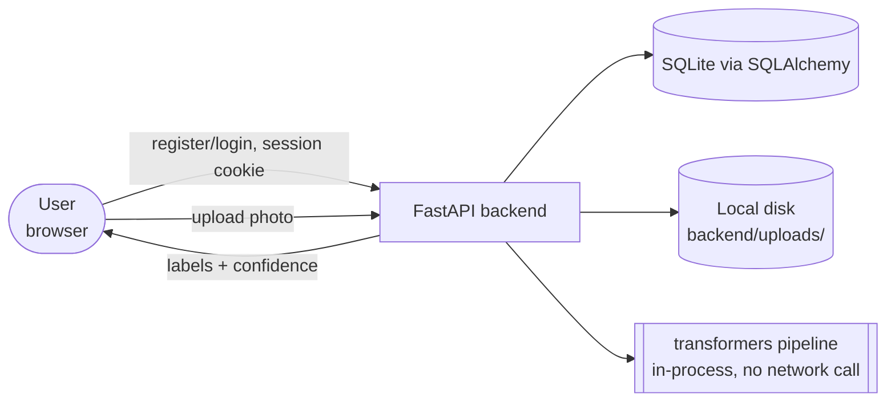
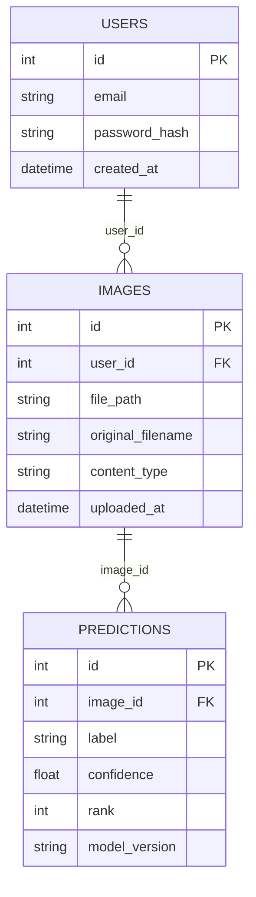

# Architecture — Image Classifier

**Status:** derived from `.scratch/image_classifier/spec-v2.md`.

## System overview



Deliberately absent: no queue/background worker (inference runs synchronously in the request —
small enough model and MVP load to not need one), no OAuth/third-party identity provider (plain
email+password), no external ML API (the model runs in-process via `transformers`, so there's no
network dependency or per-call cost at inference time — the only network calls are the one-time
model weight download), no JWT/token infrastructure (Decision #2 in the spec — session cookies
instead). The database is the single source of truth for everything; predictions are computed
once at upload time and stored, not recomputed on read.

## Database schema



`IMAGES.user_id` is what the query-layer scoping (see Authorization below) filters on — it's the
mechanism, not just a foreign key. `PREDICTIONS.model_version` is a literal constant for MVP
(spec Decision #5) but exists as a real column so a future fine-tuned model's predictions can
coexist with the pretrained model's without a migration.

## Request flow: register and log in

```
1. User submits email + password on Register.jsx
2. POST /register  (routers/auth.py)
     ├─ validate email not already taken
     ├─ hash password with passlib/bcrypt
     └─ insert USERS row
3. Response: redirect to login (or auto-login, team's call — not spec'd either way)

4. User submits email + password on Login.jsx
5. POST /login  (routers/auth.py)
     ├─ look up USERS by email, verify password hash
     └─ on success: Starlette SessionMiddleware sets a signed session cookie carrying user id
6. Response: redirect to Upload.jsx; subsequent requests carry the cookie automatically (fetch with credentials: 'include')
```

Both steps are synchronous, single-request — no email verification, no password reset flow (not
in MVP scope).

## Request flow: upload and classify

```
1. User selects a photo on Upload.jsx, submits
2. POST /images  (routers/images.py)
     ├─ require valid session (401 if missing/expired)
     ├─ validate: size ≤ 5 MB, extension in {.jpg, .jpeg, .png}, sniffed content-type matches
     │    └─ on failure: 400, no DB write, no inference call
     ├─ save file to backend/uploads/, insert IMAGES row
     ├─ call classifier.run_inference(file_path)  (classifier.py, pipeline already loaded at startup)
     │    └─ on exception (corrupt image, model error): 502, roll back the IMAGES insert, no PREDICTIONS written
     └─ on success: insert one PREDICTIONS row per returned label (top-5), stamped with the model_version constant
3. Response: the image record + its predictions, rendered as a ranked list on Upload.jsx
```

Synchronous end to end — no background job, per the System overview's "deliberately absent"
note. The `IMAGES` row is only committed once inference has actually succeeded (or the insert is
rolled back), so there's never an `IMAGES` row with zero `PREDICTIONS` rows from a failed
upload.

## Request flow: view history

```
1. User opens History.jsx
2. GET /images  (routers/images.py)
     ├─ require valid session
     └─ query: SELECT * FROM images WHERE user_id = current_user.id, joined to their predictions
3. Response: list of the user's own images + predictions, newest first
```

## Component map

```
backend/
├── main.py              # FastAPI app instance, SessionMiddleware config, router registration
├── models.py             # SQLAlchemy: User, Image, Prediction
├── auth.py                # password hashing helpers, session read/write helpers
├── classifier.py           # loads the pretrained pipeline once at import time; run_inference(path) -> list[{label, score}]
├── routers/
│   ├── auth.py             # POST /register, POST /login, POST /logout
│   └── images.py           # POST /images, GET /images — both require a valid session
└── uploads/                 # saved image files, gitignored

frontend/src/
├── pages/
│   ├── Login.jsx
│   ├── Register.jsx
│   ├── Upload.jsx           # upload form, shows returned predictions
│   └── History.jsx          # lists the current user's past uploads
└── api/client.js            # fetch wrapper, credentials: 'include' for the session cookie
```

Absent by decision: no `Jobs/`/background-worker module (synchronous inference), no `jwt.py` or
token-refresh route (session cookies instead, spec Decision #2), no `Admin/` routes or pages
(admin dashboard deferred, out of MVP scope), no `training/` or dataset-handling code
(fine-tuning deferred, out of MVP scope).

## Authentication and roles

Single role — every registered user has the same permissions, there's no admin/coach-style
distinction in this project (unlike the grade-management plans in this repo). Identity is
established by the session cookie set at login and read by a FastAPI dependency
(`get_current_user`) injected into any protected route.

## Authorization and scoping

Enforced at the query layer, not the UI: `GET /images` filters `WHERE user_id = current_user.id`
in the SQL query itself (spec Decision #3), so a logged-in user cannot reach another user's
upload history by any route this app exposes, not just because the UI never links to it. Every
route under `routers/images.py` requires a valid session via the `get_current_user` dependency —
there's no route that trusts a client-supplied user id.

## Image classification pipeline

```
upload (validated file) -> PIL.Image.open() -> transformers pipeline
    (preprocessing: resize/normalize, built into the pipeline)
    -> model forward pass -> softmax over ImageNet-1k labels
    -> top-5 {label, score} pairs
    -> one PREDICTIONS row per pair, model_version stamped
```

The pipeline object is created once at process startup (module-level in `classifier.py`), not
per-request — avoids reloading weights on every upload. Tested at the unit level against fixture
images with a known expected top-1 label (spec Test strategy); the model itself is not
retrained or fine-tuned anywhere in this project.

## Deployment shape

- App process: one FastAPI process (e.g. `uvicorn main:app`), serving both the API and holding
  the loaded model in memory
- Database: SQLite file on the same host (no separate DB server for MVP)
- Queue worker: none — inference is synchronous in-request
- Cron: none
- File storage: local disk (`backend/uploads/`) on the same host as the app process
- Third-party integrations: none — the model runs in-process, no external API calls at inference
  time (only a one-time weight download from HuggingFace's hub on first run/deploy)

## Testability

- Pure/unit-testable: `classifier.run_inference()` — file path in, list of `{label, score}` out,
  no network or DB dependency once weights are cached locally
- Feature-tested through the real HTTP/DB pipeline: register→login→session-protected route,
  upload validation (size/type rejection), successful upload → `IMAGES` + `PREDICTIONS` rows,
  `GET /images` cross-user scoping
- Deliberately never called in the test suite: nothing — unlike the RAG plan's DeepSeek calls,
  this project's only "external" dependency (the model) runs in-process and is cheap enough to
  call for real in tests, given cached weights
