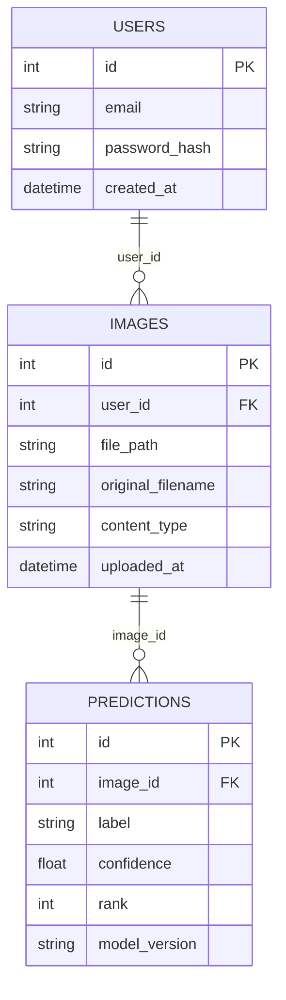

# Spec: Image Classifier — v2 (revised)

**Status:** proposal — revised after one grill pass.
**Source:** baseline `.scratch/image_classifier/spec.md`, review `.scratch/image_classifier/review.md`. This is an in-place revision, not a sibling alternative — every correction from the review was adopted with no competing architecture, so there's no separate "plan B" here.

## Thesis / Overview

A demo of a pretrained image-classification model working end-to-end through a real account/upload flow: a user registers, logs in, uploads a photo, and sees the model's ranked guesses at what's in it, with a history of past uploads. This is scoped honestly as a pretrained-model demo, not a product solving a named workflow problem the way the other plans in this repo do (Correction #5) — the value is in shipping the full loop (auth → upload → inference → display) correctly, not in the classifier's real-world usefulness.

## User stories

**Visitor.** I create an account with an email and password, then log in.

**User.** I upload a photo (JPEG/PNG, up to 5 MB). Within a few seconds I see the model's top-5 predictions, each with a label and a confidence score. I can see a history of only *my own* uploads and what the model said about each.

## Decisions taken (grill pass 1)

| # | Question | Decision |
|---|----------|----------|
| 1 | Team's Python web-framework experience? | **None.** FastAPI, its auth story, and SQLAlchemy are all new territory for the whole team — same situation `RAG_SYSTEM/spec.md` stated for Node. Budget learning time; simplify where the baseline over-specified (see #2). |
| 2 | Auth mechanism for MVP? | **Signed session cookies (Starlette `SessionMiddleware`), not JWT.** Real register/login stays in scope (it's core to the brief, not cut) — but a JWT issue/verify/refresh/storage story is one more new concept than a team new to Python web frameworks needs to learn in week 1. Session cookies are built into Starlette (FastAPI's base), need no client-side token handling, and are enough for a same-origin app with no separate mobile client. |
| 3 | Per-user data scoping? | **Enforced at the query layer.** `GET /images` filters `WHERE user_id = current_user.id` in the query itself, not just in what the UI chooses to render — closes Correction #2. |
| 4 | Upload validation limits? | **Max 5 MB, `.jpg`/`.jpeg`/`.png` only** (checked by both extension and sniffed content-type), rejected with `400` and a plain-text reason. Closes Correction #3. |
| 5 | `model_version` value for MVP? | **Literal constant** — the HuggingFace model id string (e.g. `"google/vit-base-patch16-224"`), set once in `classifier.py` and stamped onto every `PREDICTIONS` row at inference time. No versioning scheme needed until a second model (e.g. a fine-tuned one) exists. |
| 6 | Inference failure handling? | **Fail the request, don't persist a partial row.** If the pipeline call raises (corrupt image, model not yet loaded) the upload endpoint returns `502` with a short message; no `IMAGES` or `PREDICTIONS` rows are written for that attempt. The user can retry the upload. |

## Data model



Unchanged from the baseline — the review found no gap in the data model itself, only in the
unstated authorization rule around it (Decision #3).

## Image classification pipeline

Unchanged from the baseline's steps (install `transformers`/`torch`/`pillow`, load
`pipeline("image-classification", model="google/vit-base-patch16-224")` once at startup, run it
per upload, persist top-5 results). Two additions from the decisions above:

- Wrap the pipeline call in a `try/except`; on failure, return `502` and write nothing (Decision #6).
- Stamp `model_version` with the model id string constant (Decision #5).

## Tech stack

| Layer | Choice | Why |
|-------|--------|-----|
| Frontend | React | Per the brief |
| Backend | Python + FastAPI | The ML step needs Python regardless; keeps the whole backend in one language for a small route/model-call surface |
| Auth | Starlette `SessionMiddleware` (signed cookies) + `passlib`/`bcrypt` for password hashing | Decision #2 — avoids a JWT concept on top of an already-new framework for a team with no Python web experience |
| ML inference | HuggingFace `transformers` `pipeline("image-classification")`, `google/vit-base-patch16-224` (or `microsoft/resnet-50` if latency matters more) | Pretrained-only MVP, unchanged from baseline |
| Database | SQLite (dev) via SQLAlchemy | No concurrent-write pressure at MVP scale |
| File storage | Local disk (`backend/uploads/`) | Matches other plans in this repo |

## Architecture

```
image-classifier/
├── frontend/
│   └── src/
│       ├── pages/
│       │   ├── Login.jsx
│       │   ├── Register.jsx
│       │   ├── Upload.jsx        # upload form + prediction results
│       │   └── History.jsx       # user's own past uploads + predictions
│       └── api/client.js         # fetch wrapper, sends session cookie (credentials: 'include')
├── backend/
│   ├── main.py                   # FastAPI app, SessionMiddleware, router registration
│   ├── models.py                 # SQLAlchemy: User, Image, Prediction
│   ├── auth.py                   # register/login, password hashing, session helpers
│   ├── classifier.py             # loads the pretrained pipeline once at startup, run_inference()
│   ├── routers/
│   │   ├── auth.py               # POST /register, POST /login, POST /logout
│   │   └── images.py             # POST /images (upload), GET /images (own history only)
│   ├── uploads/                  # stored image files (gitignored)
│   └── requirements.txt
└── .scratch/image_classifier/    # spec.md (baseline, frozen), review.md, spec-v2.md (this file)
```

No JWT library, no token-refresh endpoint, no separate mobile/cross-origin client — all cut by
Decision #2, not deferred; a session-cookie same-origin app doesn't need them.

## MVP scope

### In
- Register / login / logout via session cookie (email + password)
- Image upload (JPEG/PNG, 5 MB max), validated by extension and sniffed content-type
- Pretrained-model classification, top-5 labels + confidence shown to the user
- Per-user upload history, scoped at the query layer to the logged-in user
- Failed-inference handling: request fails cleanly, no partial data persisted

### Out
- Fine-tuning a custom model on a labeled dataset — deferred: real additional scope (dataset collection, training loop, evaluation, checkpoint versioning); revisit once the base loop has shipped
- LLM-based (vision-language model) recognition as an alternative to a classifier — deferred: two recognition paths doubles scope for no MVP value; revisit only if the fixed ImageNet label set proves too limiting for the demo
- Object detection / bounding boxes / multi-object localization — cut: different problem than whole-image classification
- Sharing, comments, or any social feature around uploads — cut: not in the brief
- Admin dashboard / user management — deferred: not needed for a single-user demo flow
- JWT-based auth, token refresh, cross-origin/mobile client support — cut per Decision #2: a session-cookie same-origin app doesn't need them

## Risks

| Risk | Mitigation |
|------|------------|
| Team has no stated prior Python/ML *or* Python web-framework experience (Decision #1) | Budget week 1 as a two-part spike: (a) get `transformers`'s pipeline running end-to-end on one local image, (b) get a minimal FastAPI app with session-cookie login working — both before wiring the two together |
| Pretrained ImageNet-1k labels (1000 generic object classes) may not produce a compelling demo narrative | Pick the demo narrative (what photos will actually be shown live) early, and sanity-check real candidate photos against the model's actual output before locking in the pitch |
| Model weights download + first-inference latency (cold start can be several seconds) | Load the model once at FastAPI startup, not per-request; prefer a smaller checkpoint if a live demo needs snappy responses |
| Session-cookie auth still needs correct hashing/cookie-signing setup, even without JWT | Use `passlib`/`bcrypt` for hashing and FastAPI/Starlette's built-in `SessionMiddleware` (needs a real `SECRET_KEY`, not a placeholder) rather than hand-rolling either |
| Unrestricted file upload | Enforced by Decision #4: 5 MB cap, extension + sniffed-content-type check, `400` rejection |

## Workstream split (4 devs, matching the other plans in this repo)

| Week | Plan |
|------|------|
| 1 | Shared spike (not parallel): `transformers` pipeline working on a sample image; minimal FastAPI app with session-cookie register/login working. Everyone works through both together — this is the new-territory week. |
| 2 | Split: 2 devs build the upload endpoint + `classifier.py` wiring + `PREDICTIONS` persistence; 2 devs build the React auth pages (Login/Register) against the now-working backend auth |
| 3 | Split: 2 devs build the Upload.jsx page (upload + display results) and error-state handling (Decision #6); 2 devs build History.jsx + the scoped `GET /images` query (Decision #3) |
| 4 | Everyone: wire the full loop end to end against real candidate demo photos, lock in the demo narrative, fix rough edges |
| 5–6 | Polish, testing, demo prep |

## Test strategy

- Unit: `classifier.py` against a couple of fixture images with a known expected top-1 label
- Feature: full auth round-trip — register → login → session cookie accepted on a protected route (Correction #4 from the review)
- Feature: upload endpoint rejects unauthenticated requests, rejects non-image/oversized files with `400`, and a successful upload creates exactly one `IMAGES` row and 5 `PREDICTIONS` rows
- Feature: `GET /images` for user A never returns user B's images (Decision #3)
- Explicitly untested/offline: no fine-tuning/training code exists in MVP scope; no GPU-dependent performance testing

## Open questions (ordered by how much each blocks)

1. **Which pretrained checkpoint** — `google/vit-base-patch16-224` (better accuracy, slower/heavier) or `microsoft/resnet-50` (faster, smaller)? Blocks `classifier.py`, but low-risk to swap later since `model_version` is already stamped per prediction. Decide once week 1's spike shows real load/inference timing on the team's hardware.
2. **What photos will actually be used in the live demo?** Blocks locking the pitch/narrative (Risks table) — not blocking any code, but should be decided before week 4's polish pass, not during it.

## Next steps

1. Week 1 spike (part a): `pip install transformers torch pillow`, run `pipeline("image-classification")` on one local image, confirm output shape and timing
2. Week 1 spike (part b): minimal FastAPI app with `SessionMiddleware`, one seeded test user, register/login/logout working end to end
3. Scaffold `models.py` (SQLAlchemy: User, Image, Prediction) once both spikes are done
4. Build the upload endpoint wired to `classifier.py`, enforcing the 5 MB/extension/content-type checks and the fail-clean behavior on inference errors
5. Build `GET /images` scoped to `current_user.id`
6. Build the React pages against the now-working API
7. Run real candidate demo photos through the deployed pipeline and lock in the demo narrative
