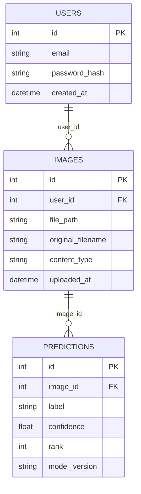

# Spec: Image Classifier

**Status:** proposal
**Source:** initial brief from the user (React frontend, login/upload, image recognition via a pretrained or fine-tuned model, Python for the ML side). No prior source document for this idea — it's a standalone concept, not an extension of the grade-management or RAG plans already in this repo.

## Thesis / Overview

A web app where a user creates an account, logs in, uploads a photo, and gets back a ranked list of what a pretrained image-classification model thinks is in it — a minimal, demoable "upload → recognize → show result" loop, with fine-tuning left as a later phase rather than MVP scope.

## User stories

**Visitor.** I create an account with an email and password, then log in.

**User.** I upload a photo (JPEG/PNG). Within a few seconds I see the model's top predictions, each with a label and a confidence score. I can see a history of everything I've uploaded and what the model said about it.

## Data model



`PREDICTIONS` stores one row per returned label (e.g. top-5), not a single column — this is what lets the UI show a ranked list and lets `model_version` be swapped later (e.g. once a fine-tuned model exists) without losing history of what an older model said.

## Image classification pipeline

This is the part the user asked "what are the steps" for. Concretely, in Python:

1. **Install the ML dependencies**: `transformers`, `torch`, `pillow` (image decoding).
2. **Load the model once, at process startup** — not per-request. Use HuggingFace's
   `pipeline("image-classification", model="google/vit-base-patch16-224")` (or the lighter
   `microsoft/resnet-50` if startup/inference latency matters more than accuracy). This pipeline
   already bundles preprocessing (resize/normalize) and postprocessing (softmax + label mapping)
   — no manual tensor work needed for a pretrained MVP.
3. **On upload**: save the file to disk, open it with `PIL.Image`, pass it to the loaded
   pipeline, take the top-k (e.g. 5) results — each a `{label, score}` pair.
4. **Persist** one `PREDICTIONS` row per result, and return them to the frontend as JSON.

No dataset, no training loop, no GPU required for this MVP — the "fine-tune ourselves" path
(building a labeled dataset, running a training loop with `Trainer` from `transformers` or plain
PyTorch, evaluating, versioning checkpoints) is real additional scope and is deferred, not
attempted here (see MVP scope below).

## Tech stack

| Layer | Choice | Why |
|-------|--------|-----|
| Frontend | React | Per the brief |
| Backend | Python + FastAPI | The ML step needs Python regardless of MVP scope; keeping the whole backend in Python avoids a Node/Python split for a 2-person-effort-sized feature (auth + upload + one inference call) |
| ML inference | HuggingFace `transformers` `pipeline("image-classification")`, pretrained checkpoint (`google/vit-base-patch16-224` or `microsoft/resnet-50`) | Pretrained-only MVP per team decision — no training pipeline or labeled dataset needed |
| Auth | FastAPI + JWT (`python-jose` or `fastapi-users`), `passlib`/`bcrypt` for password hashing | Established libraries, not hand-rolled crypto |
| Database | SQLite (dev) via SQLAlchemy, swappable to Postgres later | No concurrent-write pressure at MVP scale |
| File storage | Local disk (`backend/uploads/`) | Matches other plans in this repo (plan-a also uses local disk for MVP) |

## Architecture

```
image-classifier/
├── frontend/
│   └── src/
│       ├── pages/
│       │   ├── Login.jsx
│       │   ├── Register.jsx
│       │   ├── Upload.jsx        # upload form + prediction results
│       │   └── History.jsx       # past uploads + predictions
│       └── api/client.js         # fetch wrapper, attaches JWT
├── backend/
│   ├── main.py                   # FastAPI app, router registration
│   ├── models.py                 # SQLAlchemy: User, Image, Prediction
│   ├── auth.py                   # register/login, JWT issue/verify, password hashing
│   ├── classifier.py             # loads the pretrained pipeline once at startup, run_inference()
│   ├── routers/
│   │   ├── auth.py               # POST /register, POST /login
│   │   └── images.py             # POST /images (upload), GET /images (history)
│   ├── uploads/                  # stored image files (gitignored)
│   └── requirements.txt
└── .scratch/image_classifier/spec.md   # this file
```

## MVP scope

### In
- Register / login (email + password, JWT session)
- Image upload (JPEG/PNG, size-limited)
- Pretrained-model classification, top-k labels + confidence shown to the user
- Per-user upload history with past predictions

### Out
- Fine-tuning a custom model on a labeled dataset — deferred: real additional scope (dataset collection, training loop, evaluation, checkpoint versioning); pretrained MVP first, revisit once the team has shipped the base loop
- LLM-based (vision-language model) recognition as an alternative to a classifier — deferred: the brief mentioned it as an option, but building two recognition paths for one MVP doubles scope for no additional user value; pick a path once and revisit only if the classifier's fixed ImageNet label set proves too limiting for the demo
- Object detection / bounding boxes / multi-object localization — cut: different problem than whole-image classification, not implied by the brief
- Sharing, comments, or any social feature around uploads — cut: not in the brief
- Admin dashboard / user management — deferred: not needed for a single-user demo flow

## Risks

| Risk | Mitigation |
|------|------------|
| Team has no stated prior Python/ML experience (see `.scratch/RAG_SYSTEM/spec.md`, which ruled out Python for that project on this basis) | Budget week 1 as a spike: get `transformers`'s `pipeline("image-classification")` running end-to-end on one local image file, printing labels, before wiring any backend routes or UI around it |
| Pretrained ImageNet-1k labels (1000 generic object classes) may not produce a compelling demo narrative — a "dog" or "coffee mug" label list can read as a toy | Pick the demo narrative (what kinds of photos will actually be shown live) early, and sanity-check real candidate photos against the model's actual output before committing UI copy or the pitch to it |
| Model weights download + first-inference latency (cold start can be several seconds to load into memory) | Load the model once at FastAPI startup (not per-request); prefer a smaller checkpoint (e.g. `resnet-50` or a `mobilenet` variant) if a live demo needs snappy responses |
| Auth security — password storage, JWT handling | Use `passlib`/`bcrypt` for hashing and a maintained JWT library; don't hand-roll either |
| Unrestricted file upload (size, type) | Validate content-type and cap file size server-side before saving to disk or passing to the model |

## Test strategy

- Unit: `classifier.py` against a couple of fixture images with a known expected top-1 label (e.g. a stock photo clearly containing a dog should return a dog-adjacent ImageNet label)
- Feature: upload endpoint rejects unauthenticated requests and non-image files; a successful upload creates one `IMAGES` row and the expected number of `PREDICTIONS` rows
- Explicitly untested/offline: no fine-tuning/training code exists in MVP scope, so nothing to test there; no GPU-dependent performance testing

## Next steps

1. Week 1 spike: `pip install transformers torch pillow`, run `pipeline("image-classification")` on one local image, confirm the output shape and labels look sane
2. Scaffold the FastAPI project (`main.py`, `models.py`, SQLAlchemy setup)
3. Build auth (`POST /register`, `POST /login`, JWT issuing/verification)
4. Build the upload endpoint wired to `classifier.py`, persisting `IMAGES` + `PREDICTIONS`
5. Build the React login/register/upload/history pages against the API
6. Once real candidate photos have been run through the model, lock in the demo narrative
