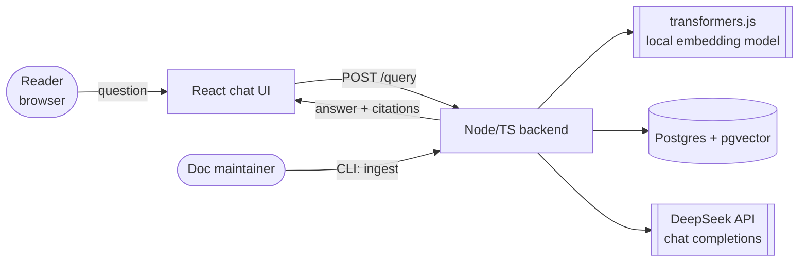
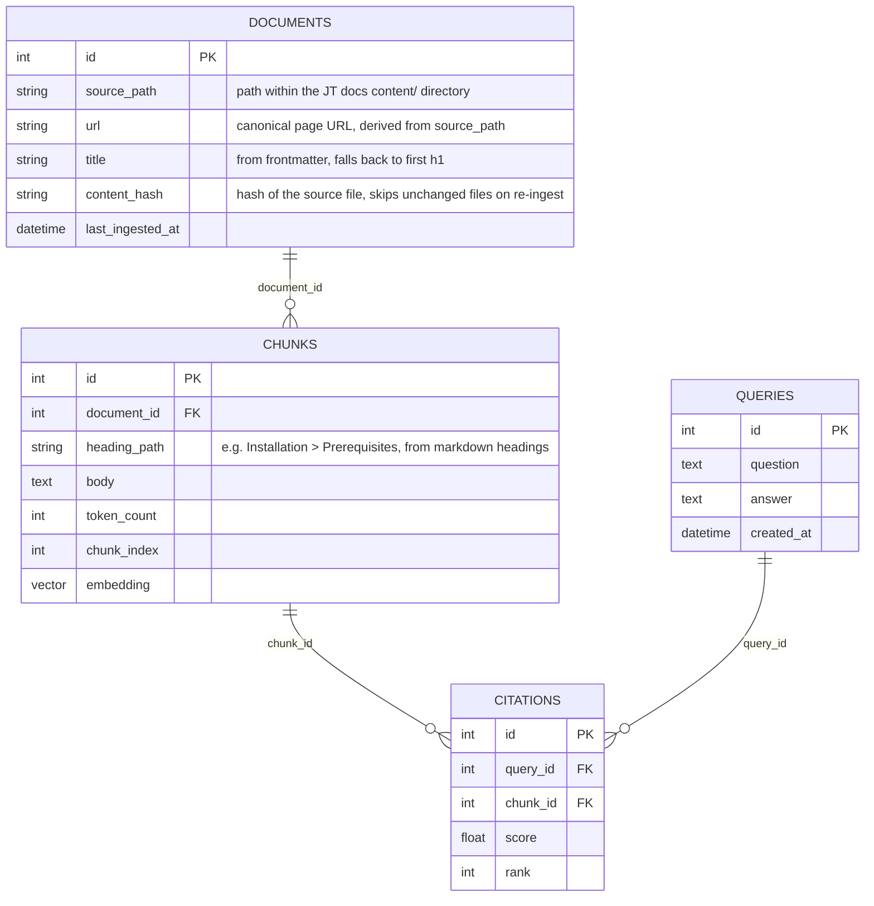

# Architecture — Documentation RAG Agent

**Status:** derived from `spec.md`. Decisions #1–7 there are the source of truth; this file expands them into the data model, request flows, and component layout.

## System overview



No queue, no cron, no crawler, no separate embeddings API — the only outbound network call at
query time is the single DeepSeek chat-completions request; embedding runs in-process. Ingestion
reads local files (the JT docs `content/` markdown directory), so it has no network dependency
either.

## Database schema



`content_hash` lets re-ingestion skip files that haven't changed since the last run instead of
re-embedding the whole corpus every time. `QUERIES`/`CITATIONS` are optional but cheap to keep —
without them there's no way to evaluate answer quality later or debug a bad answer after the fact.
`embedding` lives on `CHUNKS` as a native `pgvector` column, queried directly via SQL
(`ORDER BY embedding <-> $1 LIMIT k`) rather than through a separate vector-search service.

## Request flow: ingestion

```
1. Maintainer runs `pnpm cli ingest ./content` (or a re-ingest after a docs update)
2. loader.ts walks the JT docs content/ directory
     ├─ parses frontmatter (gray-matter) → title, any explicit metadata
     ├─ parses markdown body → AST (remark/unified)
     └─ computes content_hash per file; skips files whose hash is unchanged since last_ingested_at
3. chunker.ts splits each changed file's AST on heading boundaries (h1-h3), ~300-500 tokens, ~15% overlap
     └─ each chunk records its heading_path for citation context
4. embedder.ts runs each chunk's text through the local transformers.js model → embedding vector
5. vectorStore.ts upserts DOCUMENTS + CHUNKS rows (by content_hash) into Postgres/pgvector
```

Synchronous, one process, no queue — a full ingest run of a documentation-site-sized corpus
finishes in seconds to low minutes locally; there's no reason to background it for the MVP.

## Request flow: query

```
1. Reader submits a question in the React chat UI
2. POST /query  (routes/query.ts)
     ├─ embedder.ts embeds the question text via transformers.js
     ├─ vectorStore.ts runs a pgvector top-k similarity search
     ├─ chain.ts (LangChain.js Runnable) assembles context from the retrieved chunks + their source metadata
     ├─ deepseekClient.ts sends (system prompt + context + question) to DeepSeek chat completions
     └─ prompt.ts's system prompt enforces citing which chunk backs each part of the answer
3. Response returns { answer, citations: [{ url, heading_path, score }] } to the React chat UI
```

Single-shot per Decision #6 — no retry loop, no multi-hop retrieval. `chain.ts` is built as a
LangChain `Runnable` specifically so a later agentic loop (the DeepSeek model deciding to issue
another retrieval query) can wrap this same chain rather than replacing it.

## Component map

```
rag-agent/
├── apps/
│   ├── web/                    # React chat UI
│   └── api/                    # Node/TS backend
│       ├── ingest/
│       │   ├── loader.ts       # reads JT docs content/, parses frontmatter + markdown body
│       │   ├── chunker.ts      # heading-aware splitter over the markdown AST
│       │   └── embedder.ts     # wraps @xenova/transformers
│       ├── store/
│       │   └── vectorStore.ts  # pgvector: upsert(by content_hash), query(top_k) via SQL
│       ├── agent/
│       │   ├── chain.ts        # LangChain.js Runnable: retrieve -> assemble context -> generate
│       │   ├── deepseekClient.ts
│       │   └── prompt.ts       # system prompt enforcing the citation format
│       ├── routes/
│       │   └── query.ts        # POST /query
│       └── cli.ts              # `pnpm cli ingest ./content`
└── tests/
```

Absent by decision: no `crawler.ts`/`extractor.ts` (Decision #7 — markdown source access made
HTML crawling unnecessary), no `Jobs/` or queue worker, no auth middleware (deferred per MVP
scope in `spec.md`).

## Deployment shape

One Node process serving the API (and running the ingestion CLI as a one-off command, not a
service), one Postgres instance with the `pgvector` extension enabled (self-hosted or
Supabase-managed), and outbound HTTPS to the DeepSeek API for generation only. The embedding
model ships inside the Node process — no separate embeddings service to deploy or scale.
The React frontend is a static build served however the rest of the app is hosted.

## Testability

- `loader.ts` and `chunker.ts` are pure enough to unit-test against fixture markdown files —
  no network, no DB.
- `embedder.ts` is deterministic given a fixed model version; unit-testable against known input
  strings without hitting any external API (the model runs locally).
- The full ingest→query round trip is feature-tested against a small fixture corpus (3–5 pages),
  with `deepseekClient.ts` mocked so CI never makes a billed call — see `spec.md`'s Test strategy
  for the exact cases.
- Nothing in the automated suite crawls the real deployed site or calls DeepSeek with real
  billing; that stays manual/eyeballed in dev, same rule the grade-manager plans in this repo
  already apply to their own external calls.
