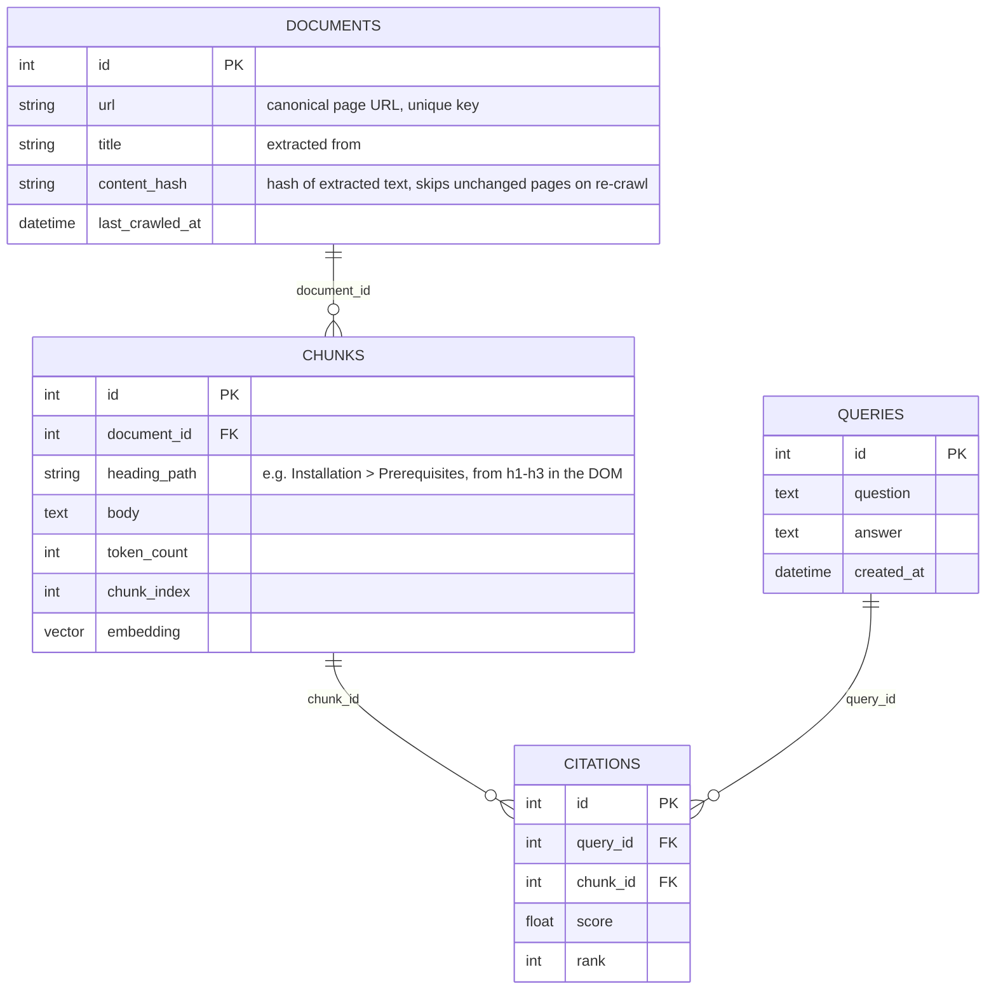

# Spec: Documentation RAG Agent

**Status:** revised — decisions locked after grill pass 1 (stack correction + follow-up questions), recorded in `review.md`.
**Source:** baseline drafted from the initial brief; revised per `review.md`'s corrections and the answers below.

## Thesis / Overview

A retrieval-augmented agent that answers natural-language questions about a documentation site
built with a static-site generator (Quartz or similar), grounding every answer in the site's own
content and citing the source page/section, using DeepSeek as the reasoning/generation model.
Built end-to-end in TypeScript (React frontend, Node/LangChain.js backend) — no Python anywhere
in the stack, per the team's stated experience.

## User stories

**Reader.** I ask a question in plain language, in a chat UI on (or alongside) the docs site, and
get a direct answer with a citation linking back to the exact page it came from.

**Doc maintainer.** When the docs site is redeployed, I run one command to re-crawl and
re-ingest the updated content so the agent's answers stay current.

## Decisions taken (grill pass 1)

| # | Question | Decision |
|---|----------|----------|
| 1 | Backend language/runtime | **TypeScript/Node, not Python.** Rules out `sentence-transformers` and the typical Chroma server; see `review.md` corrections #1–3. |
| 2 | Frontend | **React.** A chat UI is in scope, not deferred — resolves baseline Open Question #3. |
| 3 | Orchestration framework | **LangChain.js.** `Runnable`-based chain now, room to grow into an agent loop later without a rewrite. DeepSeek via `ChatOpenAI` pointed at DeepSeek's base URL, or the community `@langchain/deepseek` package. |
| 4 | Vector store | **Postgres + `pgvector`** (self-hosted or Supabase-managed). Chosen over LanceDB — the team already works in SQL, and a real DB service is worth the extra deployment piece over an embedded file store. |
| 5 | Embeddings | **Local, via `@xenova/transformers`** (ONNX, in-process, e.g. `bge-small-en-v1.5`). Zero per-call cost, accepted the added Node-process weight over calling a hosted embeddings API. |
| 6 | Agent loop ambition (MVP) | **Single-shot chain**: embed → retrieve top-k → generate once. No multi-hop retrieval loop or tool-calling for the MVP — LangChain.js's `Runnable` interface keeps this swappable later. |
| 7 | Ingestion source | **Deployed site only — no markdown source-repo access.** Ingestion crawls the rendered HTML rather than reading Quartz's `content/` directory. This is the biggest architectural change from the baseline — see below. |

## Data model



`DOCUMENTS.source_path` from the baseline is gone — without markdown source access there's no
file path, only a URL. `content_hash` is now computed from the extracted text (post-HTML-strip),
not from a source file, but serves the same purpose: skip re-embedding pages that haven't
changed since the last crawl.

## Retrieval-augmented answer pipeline

```
ingest:  sitemap.xml (or link-crawl from the index page)
                               ->  fetch each page's HTML
                               ->  extract main content, strip nav/footer/chrome
                               ->  heading-aware chunker (h1-h3 boundaries from the DOM)
                               ->  local embedder (transformers.js)
                               ->  Postgres/pgvector upsert (by content_hash)

query:   question  ->  embed query (transformers.js)
                    ->  pgvector top-k similarity search (SQL: ORDER BY embedding <-> $1 LIMIT k)
                    ->  assemble context (chunks + source metadata)
                    ->  DeepSeek chat completion via LangChain.js (system prompt enforces citing chunk sources)
                    ->  answer + citations (chunk -> document -> url), returned to the React chat UI
```

## Tech stack

| Layer | Choice | Why |
|-------|--------|-----|
| Frontend | React (chat UI) | Per team decision — in scope for MVP, not deferred |
| Backend runtime | Node.js + TypeScript | Team has no Python experience; rules out the Python-native ML tooling the baseline assumed |
| Ingestion | Custom crawler: sitemap.xml discovery (Quartz can emit one) with a link-following fallback, `cheerio` or similar for HTML parsing/extraction | No source-repo access — must work from the deployed site (Decision #7) |
| Chunking | Heading-aware splitter operating on the extracted DOM structure (h1–h3 boundaries), ~300–500 tokens, ~15% overlap | Same rationale as the baseline — chunk quality drives answer quality more than model choice |
| Embeddings | `@xenova/transformers`, e.g. `bge-small-en-v1.5`, run in-process in Node | Local, zero per-call cost (Decision #5) |
| Vector store | Postgres + `pgvector` extension (self-hosted or Supabase) | Team's existing SQL familiarity; real DB service over an embedded file store (Decision #4) |
| Orchestration / agent | LangChain.js, single-shot `Runnable` chain for MVP | Shared retriever interface that can grow into an agent loop later without a rewrite (Decision #6) |
| LLM | DeepSeek chat completions, via LangChain's `ChatOpenAI` pointed at DeepSeek's base URL (or `@langchain/deepseek`) | Per the brief; no first-party LangChain.js DeepSeek integration, so pin down which wrapper before building |
| API layer | A small Node service (Express/Fastify/Next.js API routes — pick whichever the team's React app already uses) exposing `POST /query` and a `crawl`/`ingest` CLI command | Keeps ingestion and querying decoupled; ingestion doesn't need to be a live HTTP endpoint |

## Architecture (sketch)

```
rag-agent/
├── apps/
│   ├── web/                    # React chat UI
│   └── api/                    # Node/TS backend
│       ├── ingest/
│       │   ├── crawler.ts      # sitemap discovery + link-following fallback
│       │   ├── extractor.ts    # HTML -> main content text (strips nav/footer/chrome)
│       │   ├── chunker.ts      # heading-aware splitter over the extracted DOM structure
│       │   └── embedder.ts     # wraps @xenova/transformers
│       ├── store/
│       │   └── vectorStore.ts  # pgvector: upsert(by content_hash), query(top_k) via SQL
│       ├── agent/
│       │   ├── chain.ts        # LangChain.js Runnable: retrieve -> assemble context -> generate
│       │   ├── deepseekClient.ts
│       │   └── prompt.ts       # system prompt enforcing the citation format
│       ├── routes/
│       │   └── query.ts        # POST /query
│       └── cli.ts              # `pnpm cli crawl https://docs.example.com`
└── tests/
```

## MVP scope

### In
- Crawl the deployed docs site (sitemap-first, link-following fallback), extract main content
- Heading-aware chunking of the extracted content
- Local embeddings via `@xenova/transformers`, stored in Postgres/`pgvector`
- Single-shot RAG query via LangChain.js: embed question, retrieve top-k, DeepSeek generates an answer with citations
- Citations resolve back to the source page URL
- React chat UI, calling `POST /query`
- CLI re-crawl command, skips unchanged pages via `content_hash`
- A small fixture-corpus eval: known Q/A pairs checked for correct chunk retrieval + citation presence

### Out
- Automatic re-crawl on every deploy (a CI/webhook hook) — **deferred**, manual CLI trigger is enough for MVP
- Multi-turn conversational memory across queries — **deferred**, MVP is single-shot Q&A, no session state
- A DeepSeek-driven multi-hop agent loop (multiple retrieval queries, tool use) — **cut for MVP** per Decision #6; LangChain.js keeps this swappable in later
- Reranking or fine-tuned retrieval models — **deferred**, top-k cosine similarity via pgvector is the MVP retrieval strategy
- Auth / rate-limiting on the query API — **deferred**, assumed to sit behind whatever hosts the app, or demo-only
- Non-English content handling — **out of scope** unless the actual docs are already multilingual
- Markdown source-repo ingestion path — **cut**, not deferred: Decision #7 locks in crawling the deployed site; revisit only if repo access becomes available later

## Risks

| Risk | Mitigation |
|------|------------|
| **Crawling the deployed site instead of reading markdown source loses structure.** No frontmatter, no clean file boundaries — page titles, heading hierarchy, and content boundaries all have to be inferred from the rendered DOM, and nav/sidebar/footer chrome has to be reliably stripped or it pollutes every chunk. | Hand-check the extractor against 3–5 real pages before trusting it on the full site; if Quartz's generated HTML has a consistent `<article>`/main-content container (it usually does), anchor extraction to that rather than a generic text-density heuristic. |
| **No first-party LangChain.js↔DeepSeek integration.** Community packages lag official ones in maintenance; pointing `ChatOpenAI` at DeepSeek's base URL is more likely to keep working across LangChain.js version bumps than a smaller community wrapper. | Pin down which wrapper before building the chain (see Next Steps); prefer the `ChatOpenAI`-pointed-at-DeepSeek approach unless it's missing a needed feature. |
| **`pgvector` similarity search needs an index to stay fast as the corpus grows** (a naive `ORDER BY embedding <-> $1` full-scans without one). | Add an IVFFlat or HNSW index on the embedding column once there's a realistic corpus size to tune it against — don't defer this past the point where query latency becomes visible. |
| **Local embedding model (`@xenova/transformers`) adds real weight to the Node process** — first-load latency, memory footprint — new territory for a team that hasn't run local ML models before, even without the Python angle specifically. | Load the model once at process startup, not per-request; budget time in week 1 to just get the model loading and embedding a string end-to-end before wiring anything else to it. |
| **Chunking quality still drives answer quality more than model choice.** | Same as baseline: heading-aware chunker, hand-checked against real pages before trusting it on the full corpus. |
| **DeepSeek API availability/cost at query time.** | Embeddings are local (no API dependency there); only the generation step depends on DeepSeek's API — keep `deepseekClient.ts` behind an interface in case of an outage during a demo. |

## Test strategy

- Unit: extractor against fixture HTML pages (with realistic nav/sidebar/footer chrome) — verifies main content is isolated correctly
- Unit: chunker against the extractor's output — verifies no mid-heading-section splits
- Unit: crawler against a fixture sitemap.xml and a fixture site with no sitemap (link-following fallback) — verifies both discovery paths
- Integration: crawl a 3–5 page fixture site (served locally in tests, not the real deployed site), run known Q/A pairs, assert the expected chunk is in top-k and the answer cites it — DeepSeek calls mocked/stubbed in CI
- Explicitly untested/offline: no live crawl of the real deployed site in CI, no billed DeepSeek or embedding-API calls in the automated test suite (moot for embeddings now that they're local, but keep the rule for the LLM call)

## Open questions (ordered by how much each blocks)

1. **Is a DeepSeek API key already available** (and is there a budget), or does that need setting up first? Blocks when dev/testing against the real model can start — fixture-based unit tests don't need it, but the integration test and any manual demo do.
2. **Which DeepSeek↔LangChain.js wrapper** — `ChatOpenAI` pointed at DeepSeek's base URL, or `@langchain/deepseek`? Blocks `deepseekClient.ts`; low-risk either way but should be picked once, not per-PR.
3. **Team size / timeline?** Still not given — needed before a workstream-split table makes sense; intentionally omitted from this spec until known.

Corpus size (baseline Open Question #4) is no longer blocking — Postgres/`pgvector` handles
growth without a store migration, unlike the embedded-store option it would have blocked.

## Next steps

1. Confirm the DeepSeek↔LangChain.js wrapper (Open Question #2) — small decision, but `deepseekClient.ts` is built once against it.
2. Spike the crawler against the real docs site: sitemap discovery first, fixture-check the extractor against 3–5 real pages by hand before trusting it broadly.
3. Get `@xenova/transformers` loading and embedding a string end-to-end in the Node process — budget real time for this, it's new territory for the team.
4. Stand up Postgres + `pgvector` (decide self-hosted vs. Supabase-managed) and wire the upsert/query paths.
5. Wire the LangChain.js single-shot chain end to end against the fixture corpus before touching the React UI.
6. Build the React chat UI last, once `POST /query` is proven to work.
